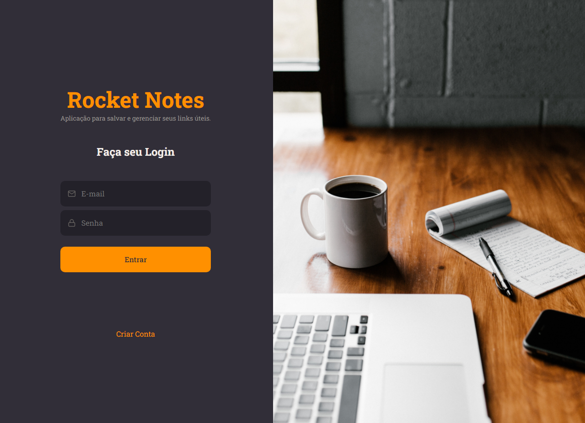

<h1 align="center"> RocketNotes </h1>

  <a href="#-tecnologias">Tecnologias</a>&nbsp;&nbsp;&nbsp;|&nbsp;&nbsp;&nbsp;
  <a href="#-projeto">Projeto</a>&nbsp;&nbsp;&nbsp;&nbsp;&nbsp;&nbsp;</a>

 

  

## 🚀 Tecnologias

Esse projeto foi desenvolvido com as seguintes tecnologias:

- HTML, CSS e JavaScript
- Github
- React
- Figma

## 💻 Projeto

Projeto RocketNote. Com essa aplicação podemos gerenciar links e adicionar anotações.

Nessa aplicação voce encontra uma interface com autenticação de usuário. O usuário pode criar sua conta e logar, podendo criar notas e gerenciar suas notas por tags.
podendo pesquisar e gerenciar todas as notas criadas na aplicação.

## 🔖 Layout

Você pode visualizar o layout do projeto através [DESSE LINK](https://www.figma.com/file/ngZxKPq5wLyHnUOQ37VbqN/RocketNotes-Copy?fuid=1117091451199493343) É necessário ter conta no [Figma](https://figma.com) para acessá-lo.

## : Licença

Esse projeto está sob a licença MIT.

---
---
Deploy:
  [Clicque aqui para acessar o Projeto!](https://rocket-notes-plum.vercel.app/)

By Thiago Caetano :wave: 
  [LinkedIn](https://www.linkedin.com/in/caetanosbr/)
  [GitHub](https://github.com/caetanosbr)
